# Head-and-Tail-Toss-Computational_Science2026
Group 9 Members:  Joanah Kate Mantiquilla, Al-Hamer Palanggalan, Armie Joy Tangalin

## Coins
### 5B (New), 1B (New) and 20
### Excel Output:
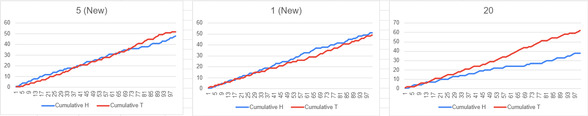
### Python Output:
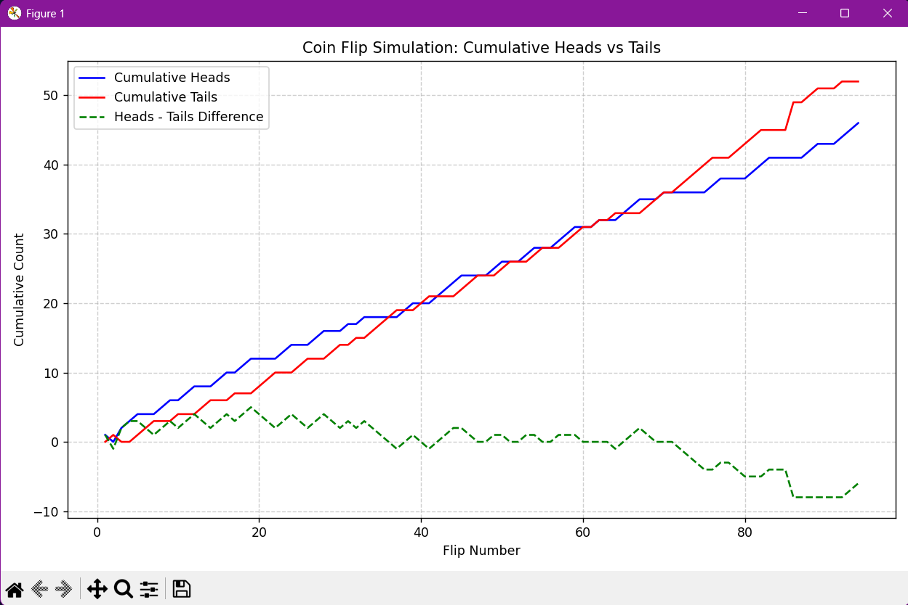
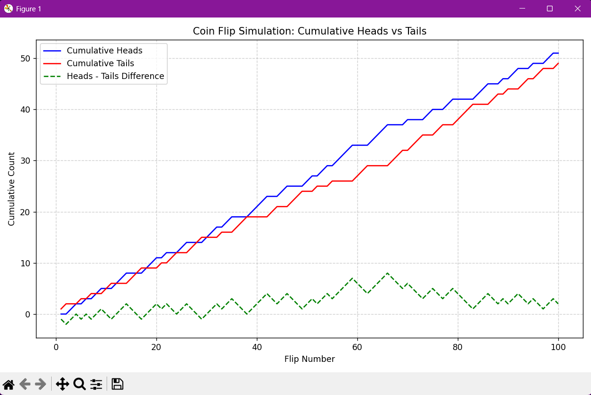
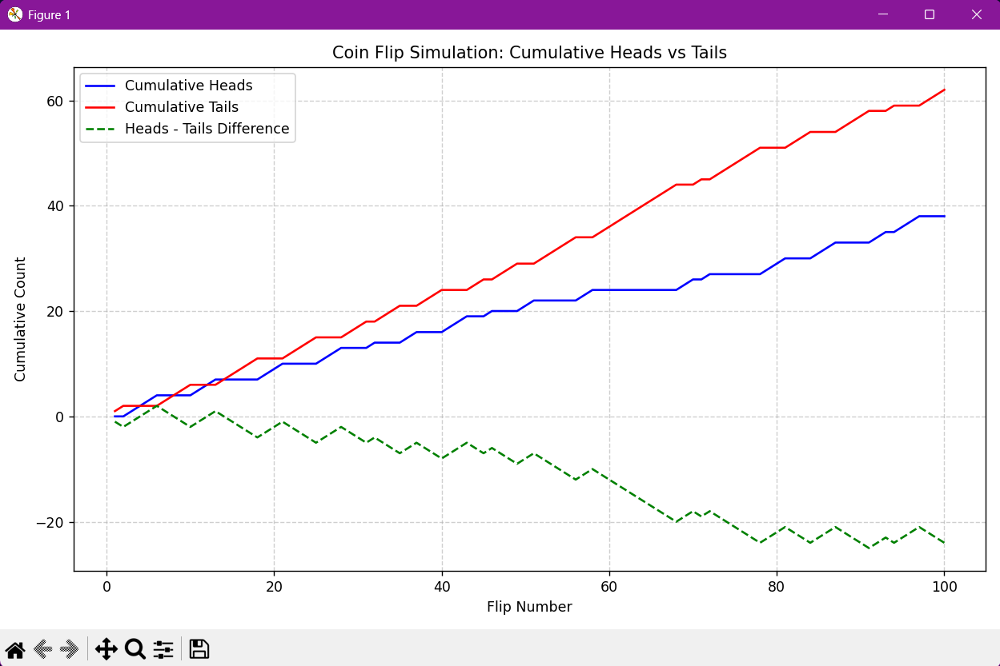

### Combination of 5B, 1B, & 20
### Excel Output:

### Python Output:
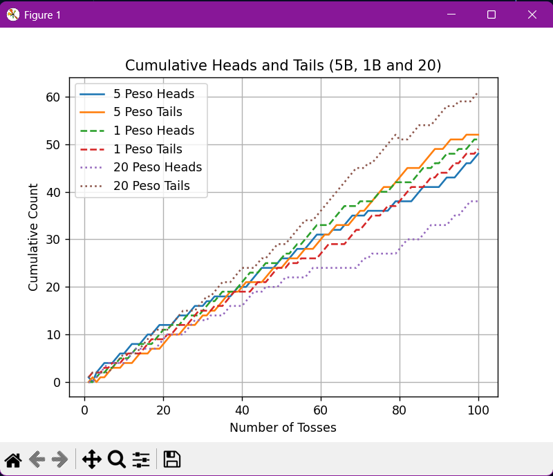

### All Class
### Excel Output:
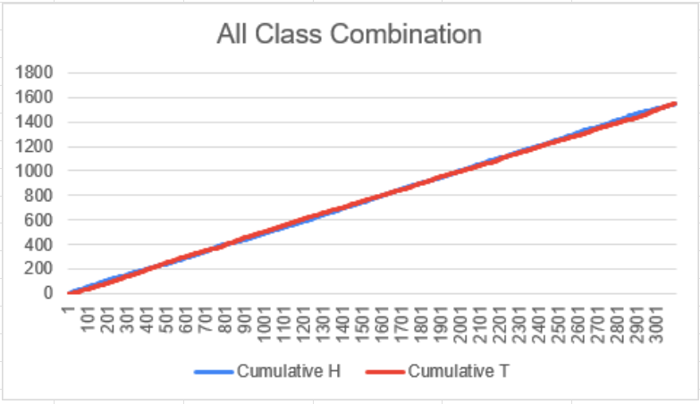
### Python Output:
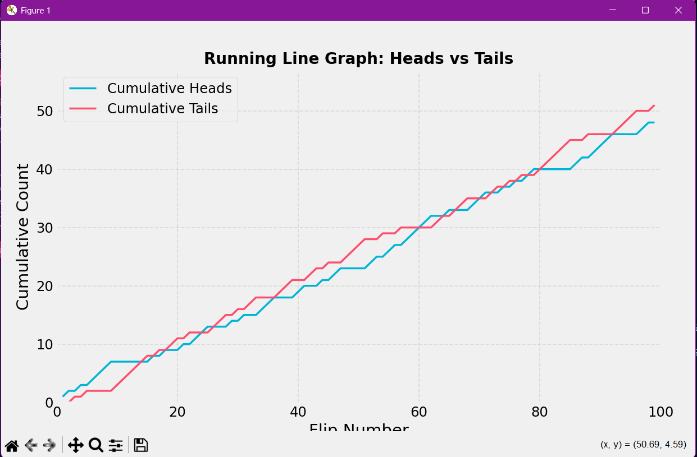

### Wood (G1-G8)
### Excel Output:
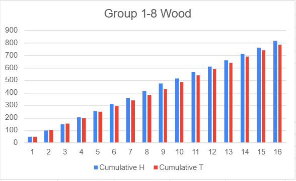
### Python Output:
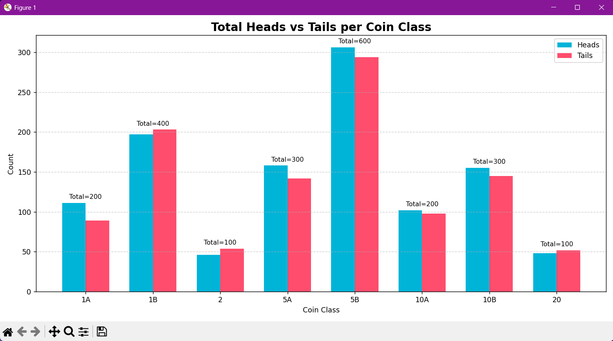

### Tiles (G9-G15)
### Excel Output:
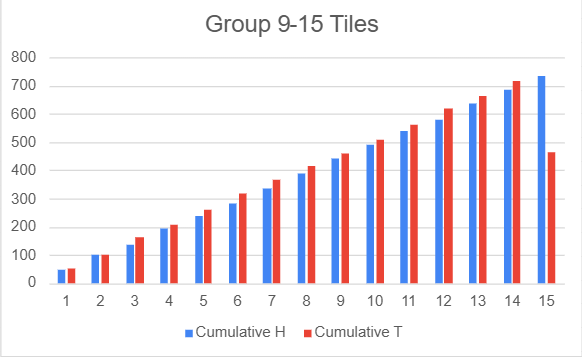
### Python Output:
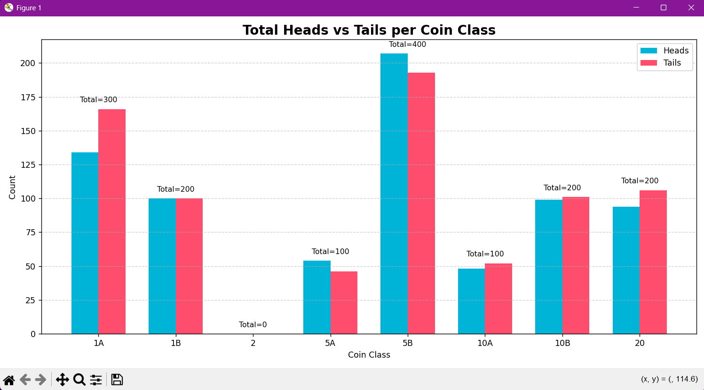

### Combination of Wood and Tiles
### Excel Output:
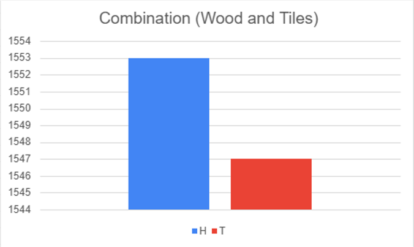
### Python Output
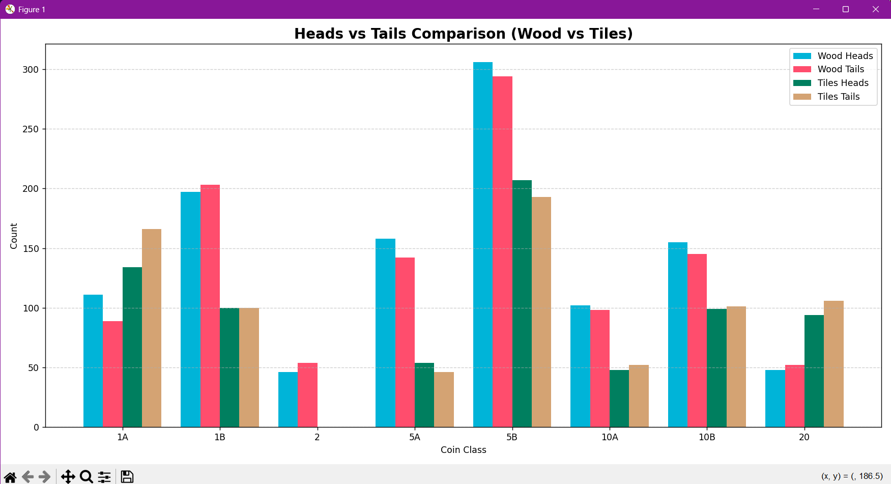

## Conclusion
### In our experiment, we observed that when we tossed the lighter coins (1 new and 5 new) higher, the result was usually heads, and when we tossed them lower, the result was usually tails. For the heavier coin (20 coin), the outcome was mostly tails whether we tossed it high or low. However, we think that the way we flipped the coin and the number of times we tested it may have affected the results. Since tossing a coin is supposed to be random, we believe more trials are needed to see if height and weight really affect the outcome.